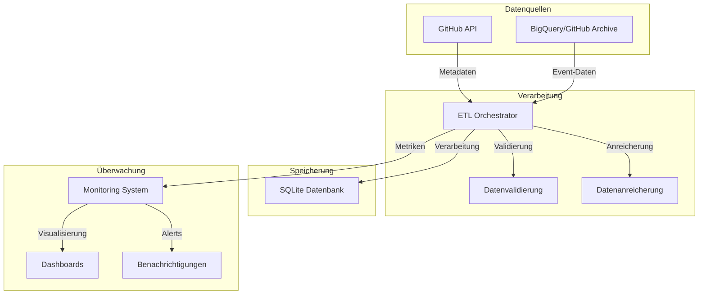

# Systemarchitektur: GitHub Data Analytics Pipeline

## 🏗 Überblick

Die GitHub Data Analytics Pipeline ist ein hybrides System, das GitHub-Aktivitätsdaten durch die Kombination von GitHub API und BigQuery erfasst und analysiert. Diese Architektur ermöglicht eine effiziente Verarbeitung großer Datenmengen bei gleichzeitiger Optimierung von Kosten und Ressourcen.

## 🔄 Datenfluss

### 1. Datenerfassung

#### GitHub API
- **Komponente**: `github_api.py`
- **Funktion**: Repository-Metadaten und aktuelle Informationen
- **Prozess**:
  1. Rate-Limit-Überprüfung
  2. API-Anfrage
  3. Response-Parsing
  4. Caching

#### BigQuery/GitHub Archive
- **Komponente**: `bigquery_api.py`
- **Funktion**: Historische Event-Daten
- **Prozess**:
  1. Query-Generierung
  2. Abfrage der GitHub Archive-Daten
  3. Ergebnisverarbeitung
  4. Optimierung für Abfragelimits (1 GB)

### 2. Datenverarbeitung

#### ETL-Orchestrator
- **Komponente**: `etl_orchestrator.py`
- **Funktion**: Koordination der Datenerfassung und -verarbeitung
- **Prozess**:
  1. Repository-Verarbeitung
  2. Event-Verarbeitung
  3. Fehlerbehandlung
  4. Batch-Verarbeitung

#### Datenanreicherung
- **Komponente**: `enrichment/data_enricher.py`
- **Funktion**: Anreicherung von Daten aus verschiedenen Quellen
- **Prozess**:
  1. Anreicherung von Repository-Daten
  2. Anreicherung von User-Daten
  3. Anreicherung von Event-Daten
  4. Caching zur Optimierung

### 3. Datenspeicherung

#### Datenbank
- **Komponente**: `database/database.py`
- **Funktion**: SQLite-Datenbank mit SQLAlchemy ORM
- **Entitäten**:
  - Repository
  - User
  - Organization
  - Event

### 4. Analyse

#### Standortanalyse
- **Komponente**: `analysis/location_analysis.py`
- **Funktion**: Analyse von Standortdaten
- **Prozess**:
  1. Analyse von Contributor-Standorten
  2. Analyse von Organisationsstandorten
  3. Identifikation aktiver Regionen

#### Organisationsanalyse
- **Komponente**: `analysis/organization_analysis.py`
- **Funktion**: Analyse von Organisationsdaten
- **Prozess**:
  1. Analyse von Organisationsaktivitäten
  2. Analyse von Organisationsmitgliedern
  3. Analyse von Organisationsrepositorien

### 5. Überwachung

#### Performance-Monitoring
- **Komponente**: `monitoring/performance_monitor.py`
- **Funktion**: Überwachung der Pipeline-Performance
- **Metriken**:
  1. Verarbeitungszeit
  2. Speichernutzung
  3. API-Aufrufe
  4. Fehlerrate

## 🔧 Komponenten

### 1. API-Integration (`api/`)
- GitHub API Client
- Rate-Limiting
- Caching
- Fehlerbehandlung

### 2. BigQuery-Integration (`bigquery/`)
- Query-Optimierung
- Kostenmanagement
- Event-Parsing
- Batch-Verarbeitung

### 3. Datenbank (`database/`)
- SQLAlchemy-Modelle
- Migrationen
- Indizierung
- Connection-Pooling

### 4. ETL-Orchestrierung (`etl_orchestrator.py`)
- Workflow-Management
- Parallelisierung
- Fehlerbehandlung
- Monitoring-Integration

## 📊 Performance-Aspekte

### 1. Parallelisierung
- Multi-Threading für API-Anfragen
- Batch-Verarbeitung für BigQuery
- Asynchrone Datenbankoperationen

### 2. Caching
- In-Memory-Cache für häufige Anfragen
- Disk-Cache für große Datensätze
- Cache-Invalidierung

### 3. Ressourcenmanagement
- Dynamische Thread-Pool-Größe
- Memory-Monitoring
- Garbage-Collection

## 🔐 Sicherheit

### 1. Authentifizierung
- GitHub API Token
- Google Cloud Service Account
- Sichere Credential-Verwaltung

### 2. Datenschutz
- Keine Speicherung sensibler Daten
- Verschlüsselte Verbindungen
- Zugriffskontrollen

## 📈 Monitoring

### 1. Performance-Metriken
- API-Latenzen
- BigQuery-Kosten
- Verarbeitungszeiten
- Speichernutzung

### 2. Fehler-Tracking
- Exception-Logging
- Stack-Traces
- Automatische Benachrichtigungen

## 🔄 Skalierung

### 1. Horizontale Skalierung
- Parallele Verarbeitung
- Batch-Größen-Optimierung
- Load-Balancing

### 2. Vertikale Skalierung
- Memory-Management
- CPU-Optimierung
- I/O-Effizienz

## 🛠 Wartung

### 1. Logging
- Strukturierte Logs
- Performance-Metriken
- Fehlerdiagnose

### 2. Updates
- Schema-Migrationen
- API-Versionierung
- Dependency-Management

## 📚 Best Practices

1. **Datenqualität**
   - Validierung aller Eingaben
   - Konsistenzprüfungen
   - Datenbereinigung

2. **Performance**
   - Query-Optimierung
   - Caching-Strategien
   - Ressourcenmanagement

3. **Wartbarkeit**
   - Modulare Struktur
   - Ausführliche Dokumentation
   - Testabdeckung
