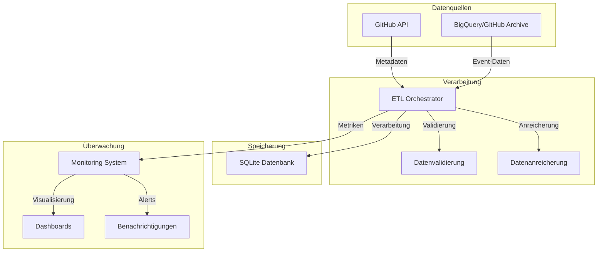
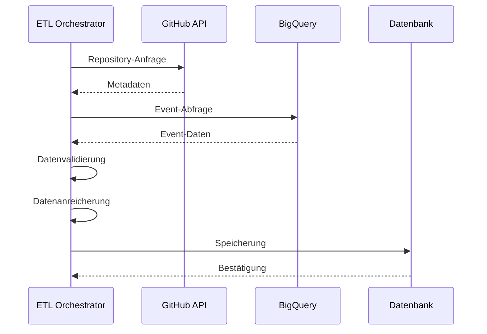
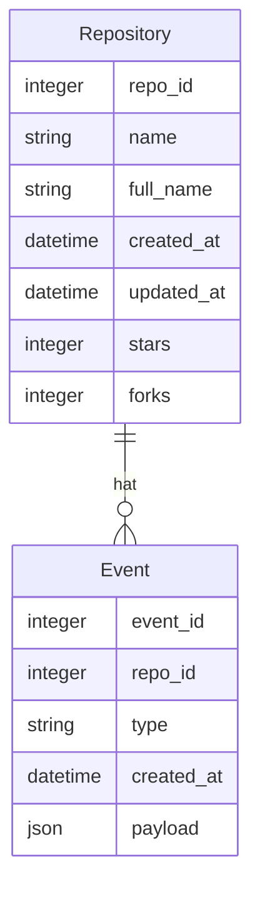

# Systemarchitektur: GitHub Data Analytics Pipeline

## 🏗 Überblick

Die GitHub Data Analytics Pipeline ist ein hybrides System, das GitHub-Aktivitätsdaten durch die Kombination von GitHub API und BigQuery erfasst und analysiert. Diese Architektur ermöglicht eine effiziente Verarbeitung großer Datenmengen bei gleichzeitiger Optimierung von Kosten und Ressourcen.

## 🔄 Datenfluss

### 1. Datenerfassung

#### GitHub API
- **Komponente**: `github_api.py`
- **Funktion**: Repository-Metadaten und aktuelle Informationen
- **Prozess**:
  1. Rate-Limit-Überprüfung
  2. API-Anfrage
  3. Response-Parsing
  4. Caching

#### BigQuery/GitHub Archive
- **Komponente**: `bigquery_client.py`
- **Funktion**: Historische Event-Daten
- **Prozess**:
  1. Query-Generierung (`query_builder.py`)
  2. Kostenabschätzung
  3. Batch-Ausführung
  4. Streaming-Verarbeitung

### 2. Datenverarbeitung

#### ETL Orchestrator
- **Komponente**: `etl_orchestrator.py`
- **Hauptfunktionen**:
  - Koordination der Datenquellen
  - Parallelisierung
  - Fehlerbehandlung
  - Fortschrittsverfolgung

### 3. Datenspeicherung

#### Datenbankschema

## 🔧 Komponenten

### 1. API-Integration (`api/`)
- GitHub API Client
- Rate-Limiting
- Caching
- Fehlerbehandlung

### 2. BigQuery-Integration (`bigquery/`)
- Query-Optimierung
- Kostenmanagement
- Event-Parsing
- Batch-Verarbeitung

### 3. Datenbank (`database/`)
- SQLAlchemy-Modelle
- Migrationen
- Indizierung
- Connection-Pooling

### 4. ETL-Orchestrierung (`etl_orchestrator.py`)
- Workflow-Management
- Parallelisierung
- Fehlerbehandlung
- Monitoring-Integration

## 📊 Performance-Aspekte

### 1. Parallelisierung
- Multi-Threading für API-Anfragen
- Batch-Verarbeitung für BigQuery
- Asynchrone Datenbankoperationen

### 2. Caching
- In-Memory-Cache für häufige Anfragen
- Disk-Cache für große Datensätze
- Cache-Invalidierung

### 3. Ressourcenmanagement
- Dynamische Thread-Pool-Größe
- Memory-Monitoring
- Garbage-Collection

## 🔐 Sicherheit

### 1. Authentifizierung
- GitHub API Token
- Google Cloud Service Account
- Sichere Credential-Verwaltung

### 2. Datenschutz
- Keine Speicherung sensibler Daten
- Verschlüsselte Verbindungen
- Zugriffskontrollen

## 📈 Monitoring

### 1. Performance-Metriken
- API-Latenzen
- BigQuery-Kosten
- Verarbeitungszeiten
- Speichernutzung

### 2. Fehler-Tracking
- Exception-Logging
- Stack-Traces
- Automatische Benachrichtigungen

## 🔄 Skalierung

### 1. Horizontale Skalierung
- Parallele Verarbeitung
- Batch-Größen-Optimierung
- Load-Balancing

### 2. Vertikale Skalierung
- Memory-Management
- CPU-Optimierung
- I/O-Effizienz

## 🛠 Wartung

### 1. Logging
- Strukturierte Logs
- Performance-Metriken
- Fehlerdiagnose

### 2. Updates
- Schema-Migrationen
- API-Versionierung
- Dependency-Management

## 📚 Best Practices

1. **Datenqualität**
   - Validierung aller Eingaben
   - Konsistenzprüfungen
   - Datenbereinigung

2. **Performance**
   - Query-Optimierung
   - Caching-Strategien
   - Ressourcenmanagement

3. **Wartbarkeit**
   - Modulare Struktur
   - Ausführliche Dokumentation
   - Testabdeckung
